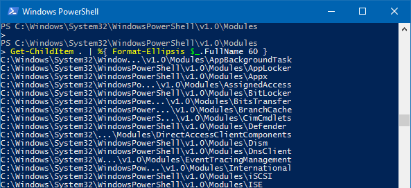

# What's this

Ellipsis function to fit your paths or any other strings into screen.

A lot of knobs and switches available to tune the output.

```
PS C:\Windows\System32\WindowsPowerShell\v1.0\Modules
> Get-ChildItem . | %{ Format-Ellipsis $_.FullName 60 }
C:\Windows\System32\Window...\v1.0\Modules\AppBackgroundTask
C:\Windows\System32\WindowsPowerShell\v1.0\Modules\AppLocker
C:\Windows\System32\WindowsPowerShell\v1.0\Modules\Appx
C:\Windows\System32\WindowsPo...\v1.0\Modules\AssignedAccess
C:\Windows\System32\WindowsPowerShell\v1.0\Modules\BitLocker
C:\Windows\System32\WindowsPowe...\v1.0\Modules\BitsTransfer
C:\Windows\System32\WindowsPower...\v1.0\Modules\BranchCache
C:\Windows\System32\WindowsPowerS...\v1.0\Modules\CimCmdlets
C:\Windows\System32\WindowsPowerShell\v1.0\Modules\Defender
C:\Windows\System32\...\Modules\DirectAccessClientComponents
C:\Windows\System32\WindowsPowerShell\v1.0\Modules\Dism
C:\Windows\System32\WindowsPowerShell\v1.0\Modules\DnsClient
...
```




# How to install and use

## As module

Download this repository and unpack the "Ellipsis" folder to a module path
(e.g. ``$env:USERPROFILE\Documents\WindowsPowerShell\Modules\``).

## As single file

Take any file from "[Single_File](Single_File)" folder and dot-source it from your scripts.


# Docs

* Type ``Get-Help Format-Ellipsis -Full`` after installing or importing module;
* or check [Format-Ellipsis.ps1](Ellipsis/Format-Ellipsis.ps1) file;
* and check [tests file](Tests/Ellipsis.Tests.ps1) for additional examples.


# License

* [MIT](LICENSE)
